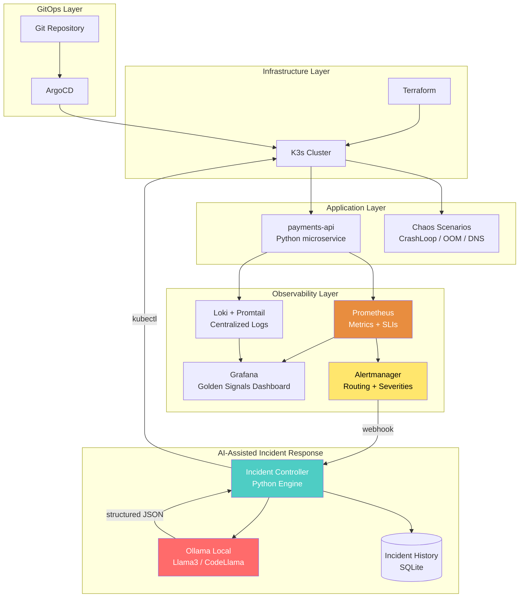

# 🚀 Lab 13: AI-Assisted SRE Platform — Qualcomm Prep

[🏠 Dashboard](../../MACR/00-DASHBOARD.md) | [🇪🇸 Español](./README.md) | [🇬🇧 English](./README.en.md)

> Laboratory designed for the **Site Reliability Engineer (Regional)** role at Qualcomm.
> Combines immutable infrastructure, advanced observability, Chaos Engineering, and the key differentiator:
> **A local AI-powered Incident Controller (Ollama) for automated diagnosis and remediation.**

---

## 🏗️ Architecture



---

## 🎯 Objective

Build a **complete incident response pipeline**:

```
Observability → Detection → Classification → AI Diagnosis → Remediation → History
```

This is not a basic Kubernetes lab. It's an **SRE platform** with:
- **SLIs/SLOs/Error Budgets** defined
- **Golden Signals** in Grafana (Latency, Traffic, Errors, Saturation)
- **Alertmanager** with severity-based routing and deduplication
- **Incident Controller** (not a "script") consuming webhooks
- **Ollama** generating structured RCA with confidence scores
- **Incident history** persisted in SQLite

---

## 📊 SLIs, SLOs & Error Budget

| SLI | SLO | Error Budget (monthly) |
|-----|-----|------------------------|
| HTTP success rate (2xx/3xx) | 99.9% availability | 43.8 min downtime |
| Latency p99 | < 500ms | 0.1% slow requests |
| Error rate (5xx) | < 0.1% | ~4,320 errors in 4.32M requests |

> **Rule:** If the error budget is exhausted before day 20 → freeze deployments and focus on stabilization.

---

## 🔥 Chaos Engineering Scenarios

Not just CPU spikes. Real production scenarios:

| Scenario | Technique | What it demonstrates |
|----------|-----------|---------------------|
| **A. CrashLoopBackOff** | Break a required ENV variable | Configuration debugging |
| **B. Readiness Probe Fail** | Kill `/health` endpoint | Impact on Service routing |
| **C. OOMKilled** | Limit memory + generate leak | Resource limits & QoS |
| **D. DNS Resolution Failure** | Corrupt CoreDNS ConfigMap | Real K8s networking |
| **E. Pod Stuck Pending** | Requests > node capacity | Scheduler & capacity planning |

---

## 🤖 Incident Controller — Expected Output

The Incident Controller doesn't just suggest a command. It generates a **structured RCA**:

```json
{
  "incident_id": "INC-2026-0517-001",
  "timestamp": "2026-05-17T14:32:00Z",
  "alert_name": "PaymentsAPIPodCrashLooping",
  "severity": "critical",
  "service": "payments-api",
  "team": "sre",
  "ai_analysis": {
    "root_cause": "Readiness probe failure — endpoint /health returning 503 after config change",
    "confidence": 0.92,
    "suggested_fix": "kubectl rollout restart deployment payments-api -n production",
    "alternative_fix": "kubectl rollout undo deployment payments-api -n production",
    "severity_classification": "high",
    "rca_summary": "The most recent deployment introduced a change to the DB_HOST variable pointing to a non-existent endpoint. The pod starts but fails the health check after 10 seconds, entering CrashLoopBackOff."
  },
  "human_approval_required": true,
  "auto_remediated": false
}
```

> **Important:** AI-generated commands require a **human approval gate** for production. This demonstrates operational maturity — it's not "cowboy automation."

---

## 📅 "Lab Weekend" Itinerary

### 🛠️ Phase 1: Immutable Infrastructure + GitOps (Saturday Morning)

**Goal:** K3s cluster + ArgoCD running.

| Component | Tool | File |
|-----------|------|------|
| Provisioning | Terraform | `main.tf`, `variables.tf`, `outputs.tf` |
| K8s Cluster | K3s (lightweight, production-ready) | `user_data` on EC2 or local |
| GitOps | ArgoCD | `argocd/` manifests |

**Deliverable:** `terraform apply` → cluster with ArgoCD syncing from Git.

---

### 📊 Phase 2: Observability + Golden Signals (Saturday Afternoon)

**Goal:** See the 4 Golden Signals in Grafana + centralized logs.

| Stack | Component | Purpose |
|-------|-----------|---------|
| Metrics | Prometheus + Alertmanager | Scraping + alerting with routing |
| Logs | Loki + Promtail | Centralized aggregation |
| Dashboards | Grafana | Golden Signals + SLO tracking |
| Test App | `payments-api` (Flask/FastAPI) | Endpoints: `/`, `/health`, `/pay` |

**Alertmanager with severity routing:**

```yaml
route:
  receiver: 'default'
  group_by: ['alertname', 'service']
  group_wait: 30s
  group_interval: 5m
  repeat_interval: 4h
  routes:
    - match:
        severity: critical
      receiver: 'incident-controller'
    - match:
        severity: warning
      receiver: 'slack-warnings'

receivers:
  - name: 'incident-controller'
    webhook_configs:
      - url: 'http://incident-controller:8080/webhook'
  - name: 'slack-warnings'
    # placeholder
  - name: 'default'
    # placeholder
```

**Golden Signals Dashboard (PromQL):**

```promql
# Latency (p99)
histogram_quantile(0.99, rate(http_request_duration_seconds_bucket{service="payments-api"}[5m]))

# Traffic (request rate)
rate(http_requests_total{service="payments-api"}[5m])

# Errors (error rate %)
rate(http_requests_total{service="payments-api", status=~"5.."}[5m])
  / rate(http_requests_total{service="payments-api"}[5m]) * 100

# Saturation (CPU)
rate(container_cpu_usage_seconds_total{pod=~"payments-api.*"}[5m])
```

**Deliverable:** Grafana with 4 panels (Latency, Traffic, Errors, Saturation) + logs in Loki.

---

### 🔥 Phase 3: Chaos Engineering + Incident Controller (Sunday Morning)

**Goal:** Break things → Alertmanager → Webhook → Incident Controller.

**Complete flow:**

```text
Prometheus detects anomaly
        ↓
Prometheus Rule evaluates condition
        ↓
Alertmanager receives alert
        ↓
Routing: severity=critical → webhook
        ↓
Incident Controller (Python) receives POST
        ↓
Classifies: does it require AI analysis?
        ↓
if severity == "critical":
    trigger_ai_analysis()
        ↓
Persists incident in SQLite
```

**Incident Controller (Python) — Structure:**

```
incident-controller/
├── app.py                  # Flask webhook receiver
├── analyzer.py             # Classification logic
├── ollama_client.py        # Ollama API client
├── remediation.py          # kubectl command executor
├── models.py               # SQLAlchemy / SQLite models
├── incidents.db            # Persisted history
├── requirements.txt
└── Dockerfile
```

**Deliverable:** Controller receiving Alertmanager webhooks and persisting incidents.

---

### 🤖 Phase 4: AI-Assisted SRE — The Differentiator (Sunday Afternoon)

**Goal:** Ollama analyzes logs and generates structured RCA with confidence scores.

**Flow:**

```text
Incident Controller receives critical alert
        ↓
Queries last 50 logs from Loki (LogQL API)
        ↓
Builds contextual prompt for Ollama
        ↓
Ollama (http://localhost:11434/api/generate)
        ↓
Structured JSON response:
  - root_cause
  - confidence score
  - suggested kubectl command
  - severity classification
  - RCA summary
        ↓
Persists in SQLite with timestamp
        ↓
If confidence > 0.85 AND severity != critical:
  → Auto-remediation (kubectl)
Else:
  → Human approval gate (log + notification)
```

**Prompt engineering for Ollama:**

```python
SYSTEM_PROMPT = """You are a Senior SRE at a large-scale platform.
You receive Kubernetes failure logs and must provide:
1. Root cause analysis in 2-3 sentences
2. A confidence score (0.0 to 1.0)
3. The exact kubectl command to remediate
4. Severity classification (low/medium/high/critical)

Respond ONLY in valid JSON format."""
```

**Deliverable:** Terminal where the AI Agent reads the failure, generates RCA in JSON, and executes (or waits for approval) the remediation.

---

## 🛠️ Final Technology Stack

| Layer | Tool | Purpose |
|-------|------|---------|
| IaC | Terraform | Immutable provisioning |
| Cluster | K3s | Lightweight, production-ready Kubernetes |
| GitOps | ArgoCD | Declarative deployments |
| Charts | Helm | App packaging |
| Metrics | Prometheus + Alertmanager | Detection + alert routing |
| Logs | Loki + Promtail | Centralized aggregation |
| Dashboards | Grafana | Golden Signals + SLO tracking |
| Incident Engine | Python (Flask) | Webhook consumer + classification |
| Local AI | Ollama (Llama3/CodeLlama) | RCA + suggested remediation |
| Persistence | SQLite | Incident history |

---

## 🛠️ Prerequisites

- ✅ Terraform installed
- ✅ Helm & Kubectl
- ✅ Ollama installed and running (`llama3` and `codellama` downloaded)
- ⬜ ArgoCD CLI (installed during Phase 1)

---

## 💡 Interview Narrative (Ready-to-use speech)

> *"I built an SRE lab focused on toil reduction and AI-assisted operations. I implemented observability with Prometheus and Loki, alerting with Alertmanager using severity-based routing, and an Incident Controller in Python that consumes operational webhooks. I integrated Ollama locally to analyze logs, generate a structured RCA with confidence scores, and suggest Kubernetes remediation. I also tested real resilience scenarios (CrashLoopBackOff, OOMKilled, DNS failure) using Chaos Engineering to validate auto-recovery and improve MTTR. Incidents are persisted in SQLite for post-analysis and operational learning."*

---

## 📎 References

- [🎯 Qualcomm JD](../../MACR/applications/qualcomm-sre-regional-jd.md)
- [📝 SRE AI Prep Notes](../../MACR/interview-prep/qualcomm/01-SRE-AI-PREP.md)
- [📖 Google SRE Book](https://sre.google/sre-book/table-of-contents/)
- [📖 Prometheus Alertmanager Docs](https://prometheus.io/docs/alerting/latest/alertmanager/)
- [📖 Ollama API Reference](https://github.com/ollama/ollama/blob/main/docs/api.md)

## 🚀 Next Steps

When you are ready to start, let me know and we will generate the Phase 1 code.
