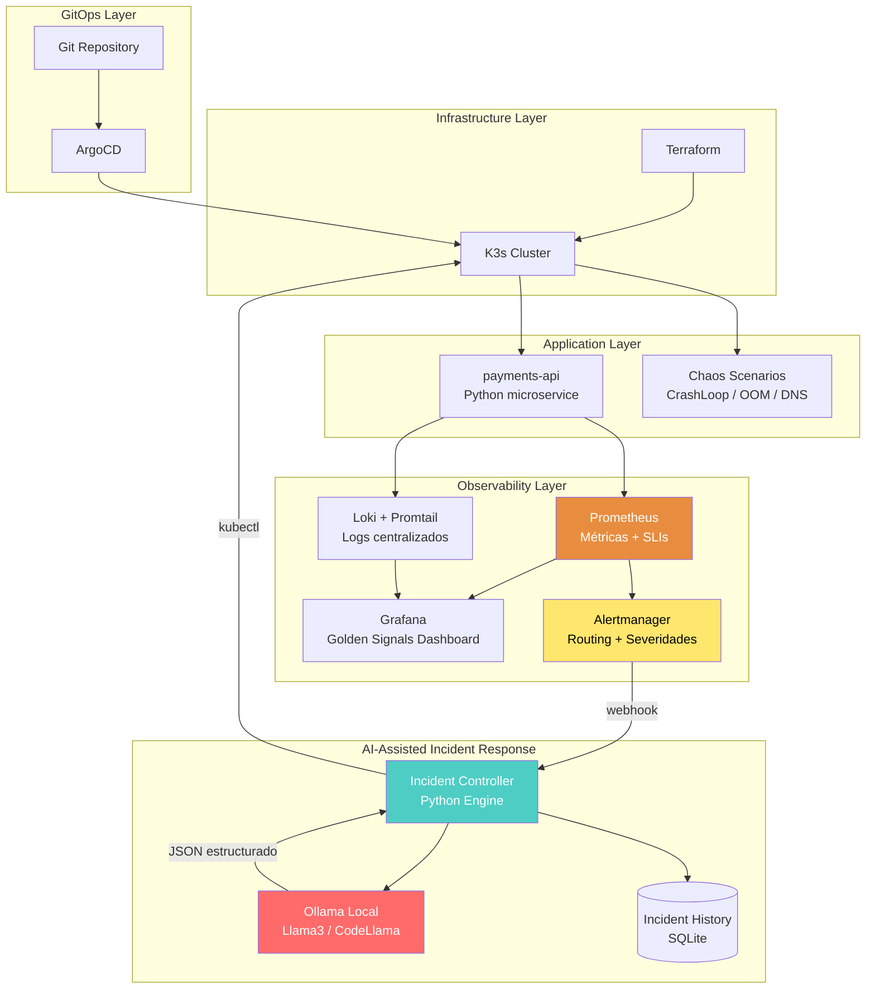

# 🚀 Lab 13: AI-Assisted SRE Platform — Qualcomm Prep

[🏠 Dashboard](../../MACR/00-DASHBOARD.md) | [🇪🇸 Español](./README.md) | [🇬🇧 English](./README.en.md)

> Laboratorio diseñado para el rol de **Site Reliability Engineer (Regional)** en Qualcomm.
> Combina infraestructura inmutable, observabilidad avanzada, Chaos Engineering y el diferenciador clave:
> **Un Incident Controller con IA local (Ollama) para diagnóstico y remediación automatizada.**

---

## 🏗️ Arquitectura



---

## 🎯 Objetivo

Construir un **flujo completo de respuesta a incidentes**:

```
Observabilidad → Detección → Clasificación → Diagnóstico IA → Remediación → Historial
```

No es un lab de Kubernetes básico. Es una **plataforma SRE** con:
- **SLIs/SLOs/Error Budgets** definidos
- **Golden Signals** en Grafana (Latency, Traffic, Errors, Saturation)
- **Alertmanager** con routing por severidad y deduplicación
- **Incident Controller** (no un "script") que consume webhooks
- **Ollama** generando RCA estructurado con confidence score
- **Historial de incidentes** persistido en SQLite

---

## 📊 SLIs, SLOs y Error Budget

| SLI | SLO | Error Budget (mensual) |
|-----|-----|------------------------|
| HTTP success rate (2xx/3xx) | 99.9% disponibilidad | 43.8 min downtime |
| Latencia p99 | < 500ms | 0.1% de requests lentos |
| Error rate (5xx) | < 0.1% | ~4,320 errores en 4.32M requests |

> **Regla:** Si el error budget se agota antes del día 20 del mes → congelar deployments y enfocar en estabilización.

---

## 🔥 Escenarios de Chaos Engineering

No solo CPU spike. Escenarios reales de producción:

| Escenario | Técnica | Qué demuestra |
|-----------|---------|---------------|
| **A. CrashLoopBackOff** | Romper variable ENV requerida | Debugging de configuración |
| **B. Readiness Probe Fail** | Matar endpoint `/health` | Impacto en Service routing |
| **C. OOMKilled** | Limitar memoria + generar fuga | Resource limits y QoS |
| **D. DNS Resolution Failure** | Corruir CoreDNS ConfigMap | Networking K8s real |
| **E. Pod Stuck Pending** | Requests > capacidad del nodo | Scheduler y capacity planning |

---

## 🤖 Incident Controller — Output Esperado

El Incident Controller no solo sugiere un comando. Genera un **RCA estructurado**:

```json
{
  "incident_id": "INC-2026-0517-001",
  "timestamp": "2026-05-17T14:32:00Z",
  "alert_name": "PaymentsAPIPodCrashLooping",
  "severity": "critical",
  "service": "payments-api",
  "team": "sre",
  "ai_analysis": {
    "root_cause": "Readiness probe failure — endpoint /health returning 503 after config change",
    "confidence": 0.92,
    "suggested_fix": "kubectl rollout restart deployment payments-api -n production",
    "alternative_fix": "kubectl rollout undo deployment payments-api -n production",
    "severity_classification": "high",
    "rca_summary": "El deployment más reciente introdujo un cambio en la variable DB_HOST que apunta a un endpoint inexistente. El pod inicia pero falla el health check tras 10 segundos, entrando en CrashLoopBackOff."
  },
  "human_approval_required": true,
  "auto_remediated": false
}
```

> **Importante:** Los comandos generados por IA requieren **human approval gate** para producción. Esto demuestra madurez operacional, no es "cowboy automation".

---

## 📅 Itinerario del "Lab Weekend"

### 🛠️ Fase 1: Infraestructura Inmutable + GitOps (Sábado Mañana)

**Meta:** Cluster K3s + ArgoCD funcionando.

| Componente | Herramienta | Archivo |
|------------|-------------|---------|
| Provisioning | Terraform | `main.tf`, `variables.tf`, `outputs.tf` |
| Cluster K8s | K3s (ligero, production-ready) | `user_data` en EC2 o local |
| GitOps | ArgoCD | `argocd/` manifests |

**Entregable:** `terraform apply` → cluster con ArgoCD sincronizando desde Git.

---

### 📊 Fase 2: Observabilidad + Golden Signals (Sábado Tarde)

**Meta:** Ver las 4 Golden Signals en Grafana + logs centralizados.

| Stack | Componente | Propósito |
|-------|------------|-----------|
| Métricas | Prometheus + Alertmanager | Scraping + alerting con routing |
| Logs | Loki + Promtail | Agregación centralizada |
| Dashboards | Grafana | Golden Signals + SLO tracking |
| App de prueba | `payments-api` (Flask/FastAPI) | Endpoints: `/`, `/health`, `/pay` |

**Alertmanager con routing por severidad:**

```yaml
route:
  receiver: 'default'
  group_by: ['alertname', 'service']
  group_wait: 30s
  group_interval: 5m
  repeat_interval: 4h
  routes:
    - match:
        severity: critical
      receiver: 'incident-controller'
    - match:
        severity: warning
      receiver: 'slack-warnings'

receivers:
  - name: 'incident-controller'
    webhook_configs:
      - url: 'http://incident-controller:8080/webhook'
  - name: 'slack-warnings'
    # placeholder
  - name: 'default'
    # placeholder
```

**Dashboard Golden Signals (PromQL):**

```promql
# Latency (p99)
histogram_quantile(0.99, rate(http_request_duration_seconds_bucket{service="payments-api"}[5m]))

# Traffic (request rate)
rate(http_requests_total{service="payments-api"}[5m])

# Errors (error rate %)
rate(http_requests_total{service="payments-api", status=~"5.."}[5m])
  / rate(http_requests_total{service="payments-api"}[5m]) * 100

# Saturation (CPU)
rate(container_cpu_usage_seconds_total{pod=~"payments-api.*"}[5m])
```

**Entregable:** Grafana con 4 paneles (Latency, Traffic, Errors, Saturation) + logs en Loki.

---

### 🔥 Fase 3: Chaos Engineering + Incident Controller (Domingo Mañana)

**Meta:** Romper cosas → Alertmanager → Webhook → Incident Controller.

**Flujo completo:**

```text
Prometheus detecta anomalía
        ↓
Prometheus Rule evalúa condición
        ↓
Alertmanager recibe alerta
        ↓
Routing: severity=critical → webhook
        ↓
Incident Controller (Python) recibe POST
        ↓
Clasifica: ¿requiere análisis IA?
        ↓
if severity == "critical":
    trigger_ai_analysis()
        ↓
Persiste incidente en SQLite
```

**Incident Controller (Python) — Estructura:**

```
incident-controller/
├── app.py                  # Flask webhook receiver
├── analyzer.py             # Lógica de clasificación
├── ollama_client.py        # Cliente para Ollama API
├── remediation.py          # Executor de kubectl commands
├── models.py               # SQLAlchemy / SQLite models
├── incidents.db            # Historial persistido
├── requirements.txt
└── Dockerfile
```

**Entregable:** Controller recibiendo webhooks de Alertmanager y persistiendo incidentes.

---

### 🤖 Fase 4: AI-Assisted SRE — El Diferenciador (Domingo Tarde)

**Meta:** Ollama analiza logs y genera RCA estructurado con confidence score.

**Flujo:**

```text
Incident Controller recibe alerta crítica
        ↓
Consulta últimos 50 logs de Loki (LogQL API)
        ↓
Construye prompt contextual para Ollama
        ↓
Ollama (http://localhost:11434/api/generate)
        ↓
Respuesta JSON estructurada:
  - root_cause
  - confidence score
  - suggested kubectl command
  - severity classification
  - RCA summary
        ↓
Persiste en SQLite con timestamp
        ↓
Si confidence > 0.85 Y severity != critical:
  → Auto-remediación (kubectl)
Si no:
  → Human approval gate (log + notificación)
```

**Prompt engineering para Ollama:**

```python
SYSTEM_PROMPT = """You are a Senior SRE at a large-scale platform.
You receive Kubernetes failure logs and must provide:
1. Root cause analysis in 2-3 sentences
2. A confidence score (0.0 to 1.0)
3. The exact kubectl command to remediate
4. Severity classification (low/medium/high/critical)

Respond ONLY in valid JSON format."""
```

**Entregable:** Terminal donde el Agente IA lee el fallo, genera RCA en JSON, y ejecuta (o espera aprobación) la remediación.

---

## 🛠️ Stack Tecnológico Final

| Capa | Herramienta | Propósito |
|------|-------------|-----------|
| IaC | Terraform | Provisioning inmutable |
| Cluster | K3s | Kubernetes ligero, production-ready |
| GitOps | ArgoCD | Deployments declarativos |
| Charts | Helm | Packaging de apps |
| Métricas | Prometheus + Alertmanager | Detección + routing de alertas |
| Logs | Loki + Promtail | Agregación centralizada |
| Dashboards | Grafana | Golden Signals + SLO tracking |
| Incident Engine | Python (Flask) | Webhook consumer + clasificación |
| IA Local | Ollama (Llama3/CodeLlama) | RCA + remediación sugerida |
| Persistencia | SQLite | Historial de incidentes |

---

## 🛠️ Requisitos Previos

- ✅ Terraform instalado
- ✅ Helm & Kubectl
- ✅ Ollama instalado y corriendo (`llama3` y `codellama` descargados)
- ⬜ ArgoCD CLI (se instala en Fase 1)

---

## 💡 Narrativa para Entrevista (Speech listo)

> *"Construí un laboratorio SRE enfocado en reducción de toil y AI-assisted operations. Implementé observabilidad con Prometheus y Loki, alerting con Alertmanager con routing por severidad, y un Incident Controller en Python que consume webhooks operacionales. Integré Ollama localmente para analizar logs, generar un RCA estructurado con confidence score, y sugerir remediación Kubernetes. También probé escenarios de resiliencia reales (CrashLoopBackOff, OOMKilled, DNS failure) usando Chaos Engineering para validar auto-recuperación y mejorar MTTR. Los incidentes se persisten en SQLite para análisis posterior y aprendizaje operacional."*

---

## 📎 Referencias

- [🎯 Qualcomm JD](../../MACR/applications/qualcomm-sre-regional-jd.md)
- [📝 SRE AI Prep Notes](../../MACR/interview-prep/qualcomm/01-SRE-AI-PREP.md)
- [📖 Google SRE Book](https://sre.google/sre-book/table-of-contents/)
- [📖 Prometheus Alertmanager Docs](https://prometheus.io/docs/alerting/latest/alertmanager/)
- [📖 Ollama API Reference](https://github.com/ollama/ollama/blob/main/docs/api.md)

## 🚀 Próximos Pasos

Cuando estés listo para empezar, avísame y generaremos el código de la Fase 1.
